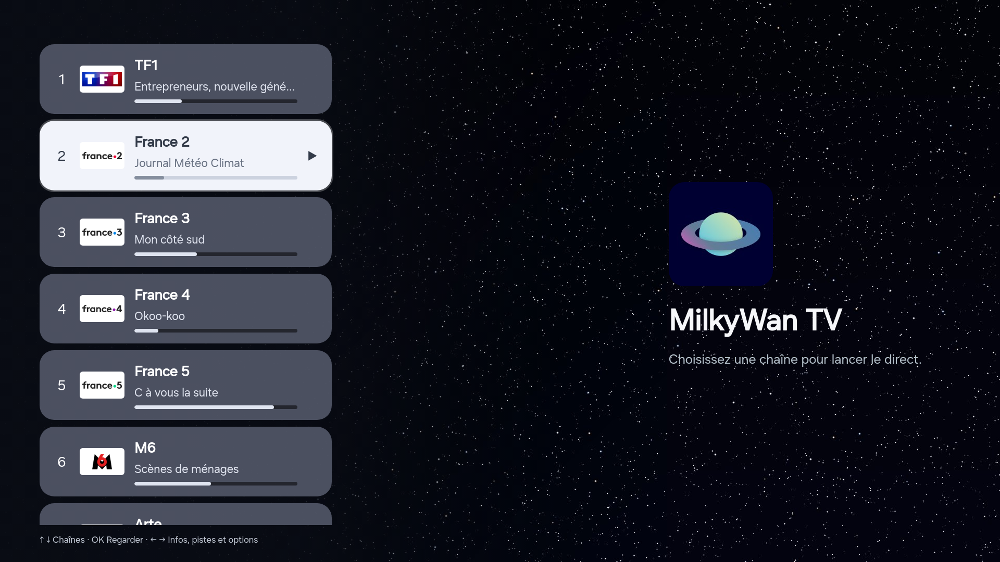
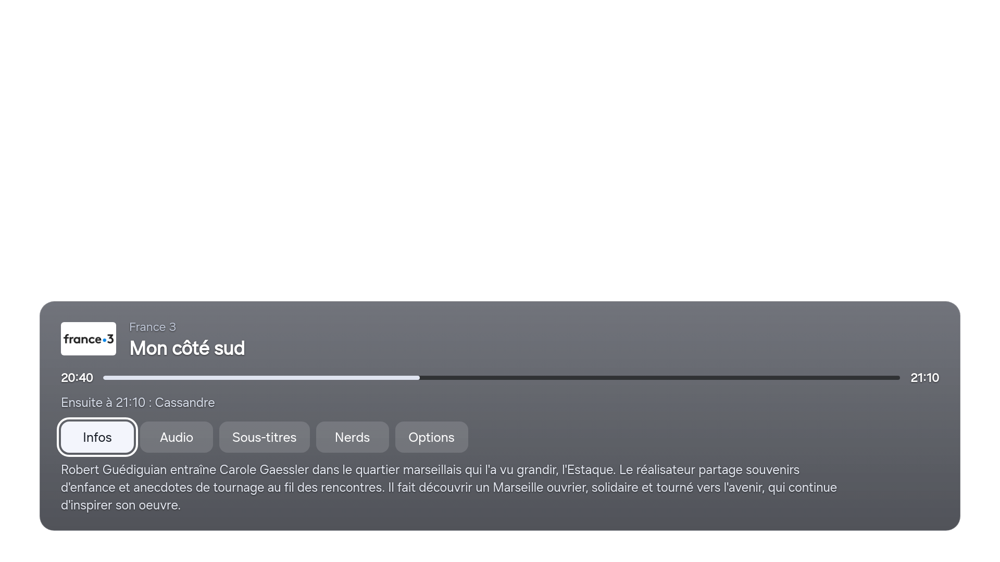
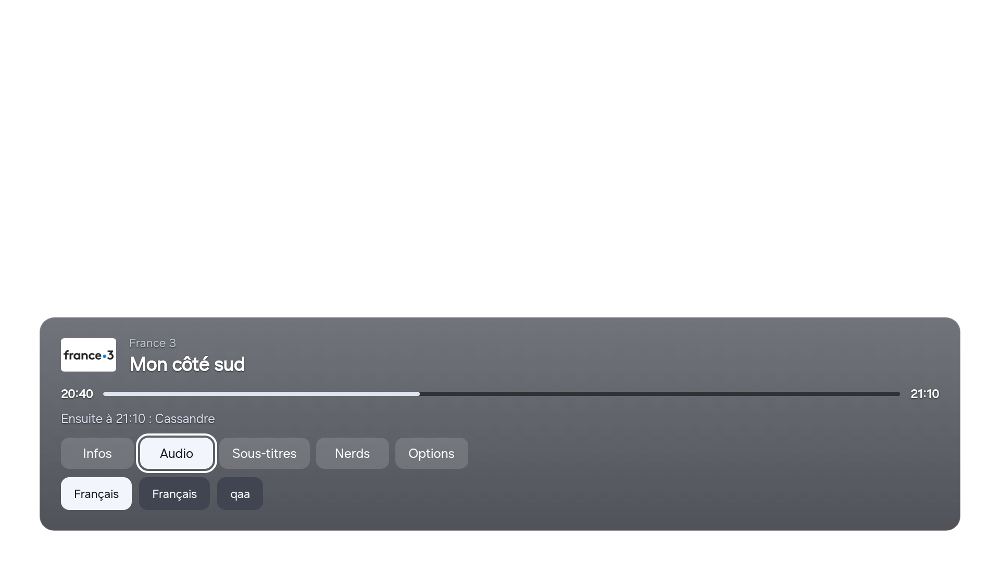
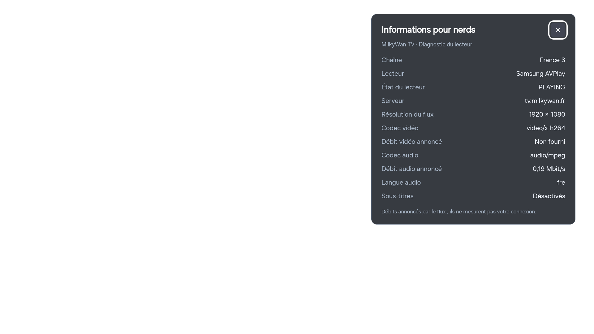
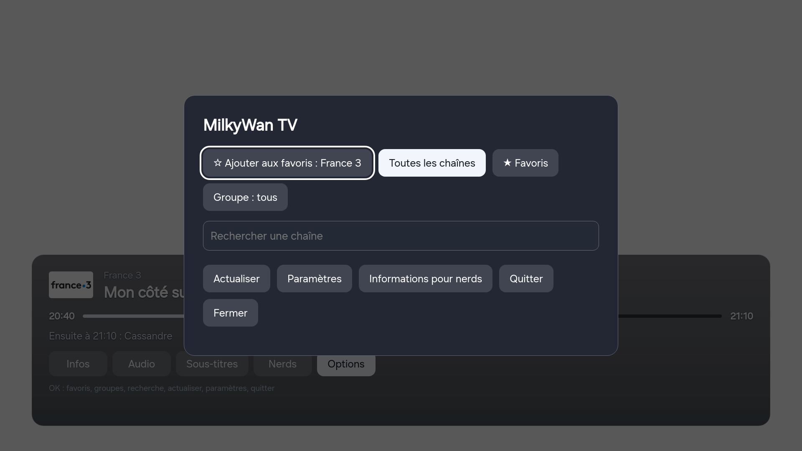
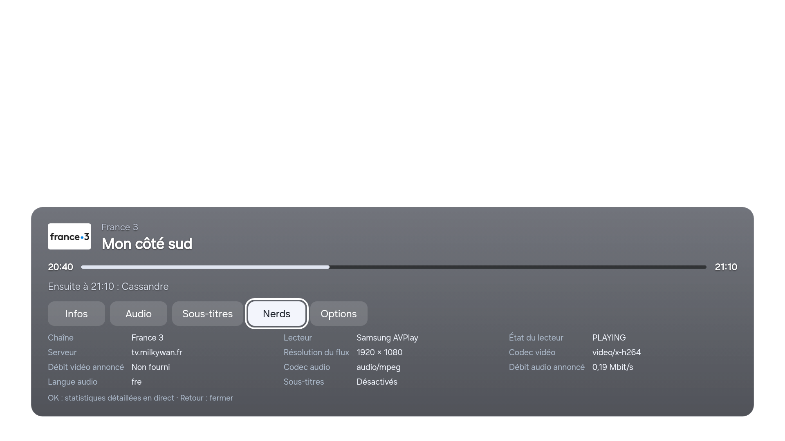
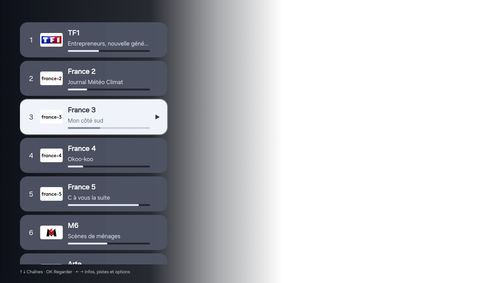

# MilkyWan TV — application TV non officielle pour Samsung Tizen

Application Tizen Web pour regarder la télévision MilkyWan (FTTH) sur une TV Samsung 2022 ou plus récente : liste des chaînes M3U, guide des programmes XMLTV, pistes audio et sous-titres, zapping rapide et statistiques « pour nerds ».

> **Projet indépendant et non officiel.** Il n'est ni développé ni soutenu par l'association MilkyWan. Il utilise la liste de chaînes et le guide publics du service, réservés aux abonnés FTTx MilkyWan : la TV doit être raccordée à ce réseau.



| Bandeau du programme | Pistes audio | Statistiques pour nerds |
|---|---|---|
|  |  |  |
| **Menu options** | **Bandeau nerds** | **Liste pendant la lecture** |
|  |  |  |

*Captures prises sur la TV : la vidéo est affichée par le lecteur matériel Samsung, sous l'interface, elle apparaît donc en noir.*

## Fonctionnalités

- **Lecteur matériel Samsung AVPlay** en plein écran, 1080i et UHD (HEVC).
- **Zapping rapide** : les chaînes précédente et suivante, ainsi que la chaîne surlignée dans la liste, sont préparées en arrière-plan. Le changement de chaîne prend environ 0,8 s au lieu d'environ 4 s.
- **Guide des programmes** (XMLTV) : programme en cours, progression, programme suivant et résumé. Il est chargé en arrière-plan et mis en cache pour un affichage immédiat au lancement.
- **Pistes audio et sous-titres** choisis directement dans le bandeau.
- **Statistiques pour nerds** : résolution, codecs, débits annoncés et état du lecteur, mises à jour en direct.
- **Favoris, groupes et recherche.**
- Pensé pour la **télécommande Samsung Smart Remote** (sans touches de couleur) : tout se fait avec les flèches et OK.
- Version **PC** de dépannage, avec un navigateur et un petit relais Python local.

## Télécommande

| Touche | Action |
|---|---|
| ↑ ↓ | Ouvrir la liste des chaînes et la parcourir |
| OK | Regarder la chaîne sélectionnée |
| ← → | Bandeau : Infos / Audio / Sous-titres / Nerds / Options |
| OK sur *Nerds* | Statistiques détaillées par-dessus la vidéo |
| OK sur *Options* | Favoris, groupes, recherche, actualiser, paramètres, quitter |
| CH ∧ ∨ | Zapper dans la sélection actuelle |
| Retour | Fermer la liste, le bandeau ou le menu sans couper le direct |
| Lecture/Pause | Mettre en pause ou reprendre |

Les touches de couleur restent prises en charge sur les télécommandes qui en ont : rouge pour les options, vert pour les nerds, bleu pour les favoris.

## Performances mesurées

Mesures faites sur une Samsung TU70DU7105 (2024, Tizen 9.0, CPU ARM 4 cœurs, 1,5 Go de RAM) :

| | Avant optimisation | Version actuelle |
|---|---|---|
| Changement de chaîne (CH ∧ ∨) | ~10,5 s | **~0,8 s** |
| Première chaîne | ~10,5 s | ~4 s |
| Chargement du guide (EPG de 24 Mo) | 9,3 s, interface figée | 1,6 s en arrière-plan |
| Déplacement dans la liste | 52 ms | ~25 ms |
| Ouverture du bandeau | 126 ms | ~10 ms |
| Mémoire JavaScript | — | ~10 Mo, stable |

## Installation sur la TV

Il faut un ordinateur avec **Tizen Studio** (CLI) et un **compte Samsung**. Une application non publiée doit être signée avec un certificat Samsung lié à *votre* TV : aucun paquet `.wgt` signé ne peut être fourni pour toutes les TV.

1. Installez Tizen Studio avec les extensions **Samsung TV** et **Samsung Certificate**.
2. Sur la TV, ouvrez **Apps**, tapez **1 2 3 4 5** et activez le **mode développeur** en indiquant l'adresse IP de l'ordinateur. Redémarrez la TV.
3. Connectez la TV : `sdb connect <IP-de-la-TV>`
4. Dans **Certificate Manager**, créez un profil **Samsung → TV** (connexion au compte Samsung). Le DUID de la TV connectée est ajouté automatiquement.
5. Construisez, signez et installez :

```bash
tizen package -t wgt -s <votre-profil> -- .
tizen install -n "MilkyWan TV.wgt" -t <nom-de-la-TV>
tizen run -p MilkywanTV.Main -t <nom-de-la-TV>
```

Les fichiers `README.md`, `CHANGELOG.md`, `docs/`, `serve-pc.py` et `Lancer-PC.*` ne servent pas sur la TV. Vous pouvez les exclure du paquet.

## Version PC

Le serveur de la liste ne renvoie pas d'en-têtes CORS. `serve-pc.py` lance donc un relais local limité à `tv.milkywan.fr`.

- macOS : `Lancer-PC.command`, Windows : `Lancer-PC.bat`, Linux : `python3 serve-pc.py`
- Puis ouvrez <http://127.0.0.1:8765/>.

La lecture passe par mpegts.js et MSE. La plupart des chaînes sont diffusées en **1080i entrelacé**, que les navigateurs ne savent généralement pas lire par MSE : la version PC sert surtout au guide et au dépannage.

## Notes techniques

- **Tampon AVPlay** : AVPlay impose par défaut 10 s de tampon, ramenées ici à 1 s, le minimum accepté. Une valeur de 0 s ou en octets est ignorée sans erreur.
- **Pré-chargement** : l'application utilise jusqu'à 4 instances `webapis.avplaystore` en `PREBUFFER_MODE`, dans un pool fixe réutilisé. Créer de nouvelles instances finit par épuiser les décodeurs.
- **Guide** : un analyseur XMLTV par chaînes de caractères tourne dans un Web Worker et ne garde que les 36 prochaines heures. Il est environ 6 fois plus rapide que `DOMParser`.
- **mpegts.js 1.8.2** (version PC) est corrigé pour les flux DVB : audio AC-3/E-AC-3 signalé par descripteur, keyframes sans IDR, paires de trames entrelacées (PAFF). Le détail figure en tête de `vendor/mpegts-1.8.2.js`.
- User-Agent des flux : `MilkyWan-TizenOS non officiel`.

## Licences

- Code de MilkyWan TV : **GNU GPL v3.0** (`LICENSE`). Vous pouvez l'utiliser, le modifier et le redistribuer, à condition de publier vos modifications sous la même licence.
- mpegts.js : Apache License 2.0 (`vendor/mpegts-LICENSE`), modifié comme indiqué ci-dessus.
- Le fond étoilé (`galaxy.jpg`) est généré par programme pour ce projet.
- MilkyWan est le nom du fournisseur d'accès associatif. Ce projet n'y est pas affilié.
